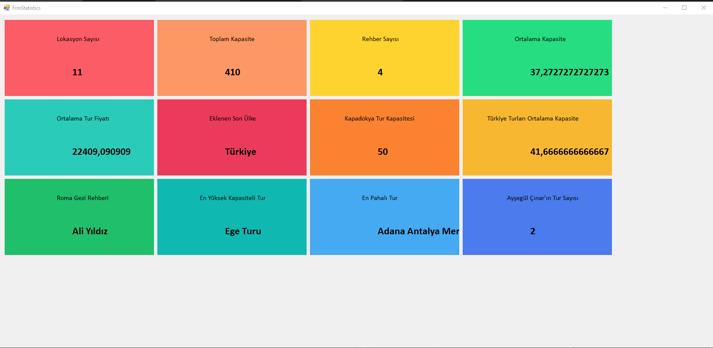

# C-Egitim-Kampi
Murat Yücedağ'ın Youtube'da başlattığı C# eğitim kampının kodları yer alıyor.

📍 Proje 1: Merhaba Dünya!
İlk projede, konsola yazı yazdırarak Console.WriteLine() komutunu keşfettim ve bir C# programının temel yapısını anladım. 🌍

📍 Proje 2: Değişkenler
İkinci projede int, string, double gibi veri türleri ile değişken tanımlamayı ve işlemler yapmayı öğrendim. 🔢

📍 Proje 3: Diziler (Arrays)
Bu projede, diziler aracılığıyla birden fazla değeri nasıl depolayabileceğimi ve döngüler yardımıyla verileri nasıl işleyebileceğimi gördüm. 🧩

📍 Proje 4: Karar Yapıları (If-Else)
Karar yapıları oluşturarak programın farklı koşullara göre nasıl davrandığını test ettim. ⚖️

📍 Proje 5: Döngüler (Loops)
Döngüler ile tekrarlayan işlemleri otomatikleştirmeyi öğrendim. for, while ve foreach döngüleri ile tanıştım. 🔄

📍 Proje 6: Metotlar (Methods)
Kodları daha düzenli ve yeniden kullanılabilir hale getirmek için metotlar oluşturdum. Parametre alıp işlem yapan metotlar yazdım. 🛠️

📍 Proje 7: Foreach Döngüsü ve Sınav Sistemi
Bir sınav simülasyonu oluşturarak, foreach döngüsünü daha detaylı inceledim. Not ortalamalarını hesaplayıp geçme/kalma durumlarını belirledim. 🎓

📍 Proje 8: Geriye Değer Döndüren Fonksiyonlar
Son projede, kullanıcı girdilerini işleyerek geriye değer döndüren fonksiyonlar geliştirdim. Bu proje ile daha karmaşık işlemleri uygulama fırsatı buldum. 🎗️

Bu C# temel videolar sayesinde C# temellerini çok iyi anladım.

<h1>TASK 3 Görevi</h1>
<h3>Entity Framework Metotları ve Linq Sorgularını kullanarak veritabanında yer alan bilgilerini oluşturduğumuz form üzerinde panel,label ekleme işlemlerinin ardından gerçekleştirdik</h3>

